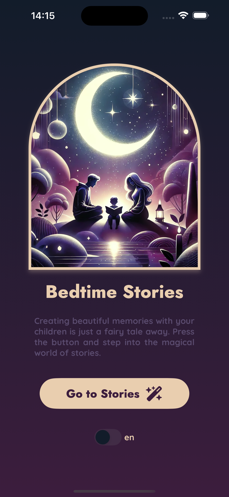
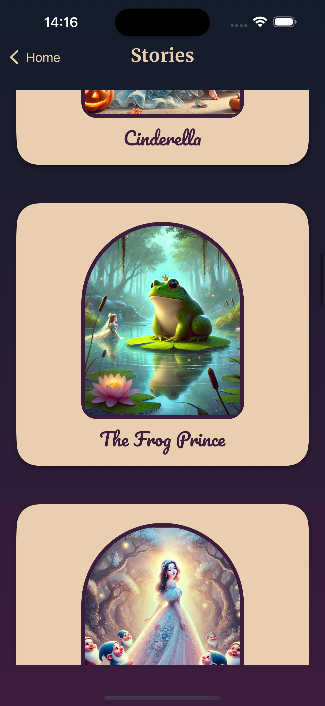
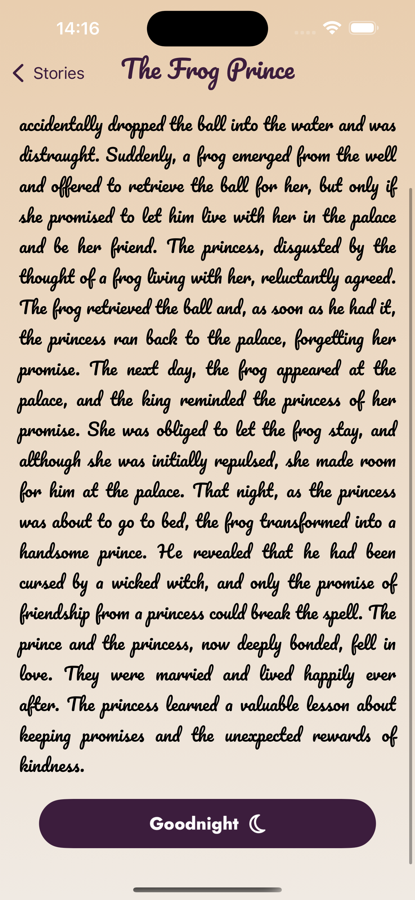

# 📱 StoryNest

## 🎯 Purpose  
This project was developed to provide parents and children with free access to various stories. I created it to improve my UI design and animation skills.

---

## 🛠️ Technologies Used  
- **Expo**  
- **Firebase**   
- **TypeScript**
- **VS Code / Android Studio**

---

## 🚀 Installation and Running  
To run the project on your local machine, follow the steps below:

1. **Clone the project:**  
   ```bash
   git clone https://github.com/username/project-name.git
   cd project-name

2. **Install Dependencies:**  
   ```bash
   npm install
   #or
   yarn install

---

## 📸 Screenshots  
| Home | List | Story | 
|----------|----------|----------| 
|  |  |  |
